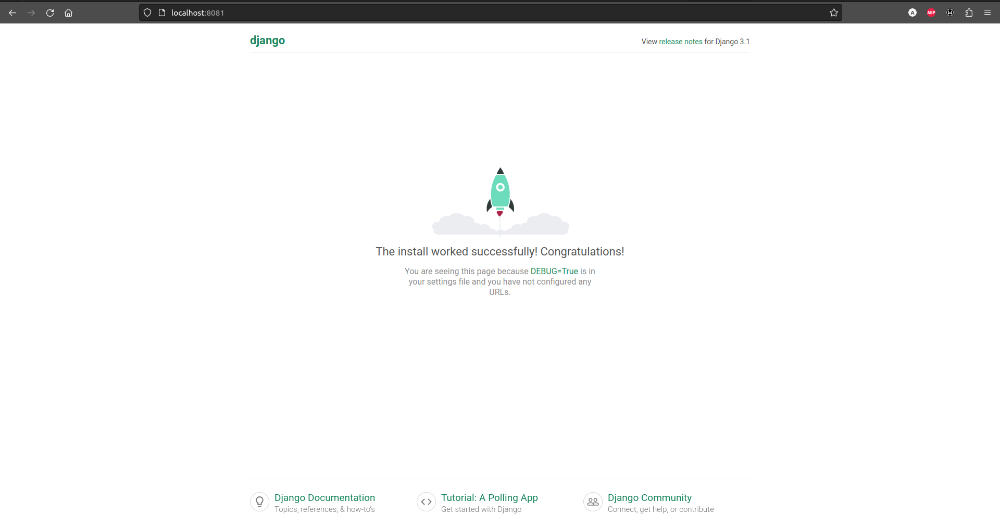
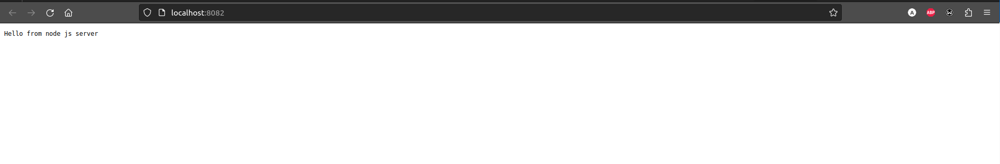
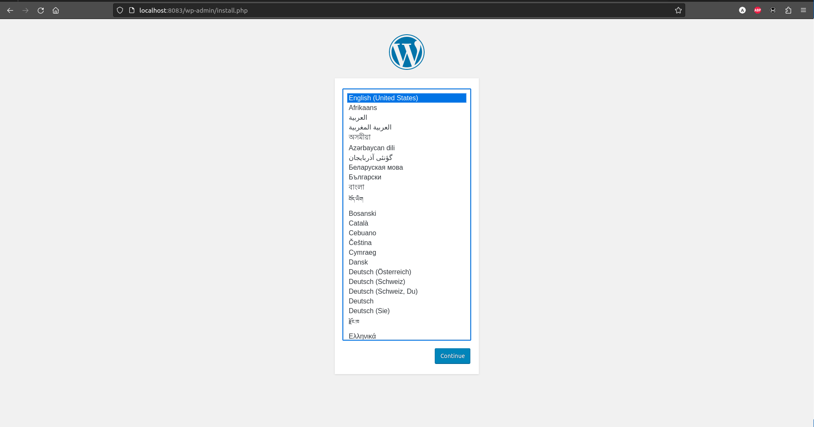

# Dynamic Web
Для выполнения этого действия требуется установить приложением git:
`git clone https://github.com/altyn-kenzhebaev/dynamicweb-hw26.git`
В текущей директории появится папка с именем репозитория. В данном случае dynamicweb-hw26. Ознакомимся с содержимым:
```
cd dynamicweb-hw26
ls -l
ansible
project
README.md
screens
Vagrantfile
```
Здесь:
- ansible - папка с плэйбуком
- screens - папка со скриншотами для рукуводства
- project - папка для запуска docker-compose
- README.md - файл с данным руководством
- Vagrantfile - файл описывающий виртуальную инфраструктуру для `Vagrant`
Запускаем ВМ:
```
vagrant up
```

## python (flask/django) 
Добавляем следующее:
```
# nginx.conf
#Сервер nginx для django:
upstream django {
  server app:8000;
}
server {
# Django будет отображаться на 8081 порту хоста
   listen 8081;
   listen [::]:8081;   
   server_name localhost;
  location / {
    try_files $uri @proxy_to_app;
  }
# тут используем обычное проксирование в контейнер django
  location @proxy_to_app {
    proxy_pass http://django;
    proxy_http_version 1.1;
    proxy_set_header Upgrade $http_upgrade;
    proxy_set_header Connection "upgrade";
    proxy_redirect off;
    proxy_set_header Host $host;
    proxy_set_header X-Real-IP $remote_addr;
    proxy_set_header X-Forwarded-For $proxy_add_x_forwarded_for;
    proxy_set_header X-Forwarded-Host $server_name;
  }
}
# docker-compose.yml
  app:
    build: ./python
    container_name: app
    restart: always
    env_file:
      - .env
    networks:
      - app-network
# requirement
Django==3.1
gunicorn==20.0.4
pytz==2020.1
# Dockerfile
FROM python:3.8.3
COPY requirement requirement
RUN pip install -r requirement
COPY . code
WORKDIR /code
EXPOSE 8000

# runs the production server
ENTRYPOINT ["python", "manage.py"]
CMD ["runserver", "0.0.0.0:8000"]
```

##  php-fpm (laravel/wordpress)
 Добавляем следующее:
```
# nginx.conf
# Данный сервер отвечает за проксирование на wordpress через fastcgi
server {
# Wordpress будет отображаться на 8083 порту хоста
        listen 8083;
        listen [::]:8083;
        server_name localhost;
        index index.php index.html index.htm;

# Задаем корень корень проекта, куда мы смонтировали статику wordpress
        root /var/www/html;
        location ~ /.well-known/acme-challenge {
                allow all;
                root /var/www/html;
        }
        location / {
                try_files $uri $uri/ /index.php$is_args$args;
        }
# Само fastcgi проксирование в контейнер с wordpress по 9000 порту
        location ~ \.php$ {
                try_files $uri =404;
                fastcgi_split_path_info ^(.+\.php)(/.+)$;
                fastcgi_pass wordpress:9000;
                fastcgi_index index.php;
                include fastcgi_params;
                fastcgi_param SCRIPT_FILENAME $document_root$fastcgi_script_name;
                fastcgi_param PATH_INFO $fastcgi_path_info;
        }

        location = /favicon.ico {
                log_not_found off; access_log off;
        }

        location ~* \.(css|gif|ico|jpeg|jpg|js|png)$ {
                expires max;
                log_not_found off;
        }
}
# docker-compose.yml
services:
  database:
    image: mysql:8.0
    container_name: database
    restart: unless-stopped
    environment:
      MYSQL_DATABASE: ${DB_NAME}
      MYSQL_ROOT_PASSWORD: ${DB_ROOT_PASSWORD}
    volumes:
      - ./dbdata:/var/lib/mysql
    command: '--default-authentication-plugin=mysql_native_password'
    networks:
      - app-network


  wordpress:
    image: wordpress:5.1.1-fpm-alpine
    container_name: wordpress
    restart: unless-stopped
    environment:
      WORDPRESS_DB_HOST: database
      WORDPRESS_DB_NAME: "${DB_NAME}"
      WORDPRESS_DB_USER: root
      WORDPRESS_DB_PASSWORD: "${DB_ROOT_PASSWORD}"
    volumes:
      - ./wordpress:/var/www/html
    networks:
      - app-network
    depends_on:
      - database
```

##  js(react/angular)
Добавляем следующее:
```
# nginx.conf
#Сервер nginx для node.js:
# Node.js будет отображаться на 8082 порту хоста
server {
   listen 8082;
   listen [::]:8082;   
   server_name localhost;
  location / {
    proxy_pass http://node:3000;
    proxy_http_version 1.1;
    proxy_set_header Upgrade $http_upgrade;
    proxy_set_header Connection "upgrade";
    proxy_redirect off;
    proxy_set_header Host $host;
    proxy_set_header X-Real-IP $remote_addr;
    proxy_set_header X-Forwarded-For $proxy_add_x_forwarded_for;
    proxy_set_header X-Forwarded-Host $server_name;
  }
}

# docker-compose.yml
  node:
    image: node:16.13.2-alpine3.15
    container_name: node
    working_dir: /opt/server
    volumes:
      - ./node:/opt/server
    command: node test.js
    networks:
      - app-network
```
## Проверка работоспособности

)
)